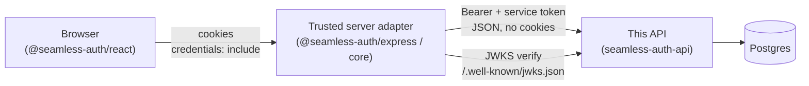

# Architecture

Seamless Auth API is an Express and TypeScript authentication service backed by Postgres. It provides passwordless authentication primitives, session issuance, JWKS publication, runtime system configuration, and administrative API endpoints for operators.

## Runtime Components

- Express app: global middleware, CORS, rate limits, OpenAPI metadata, and route loading.
- Routes: thin endpoint declarations with request and response schemas.
- Controllers: request handling and response shaping.
- Services: reusable auth, session, messaging, organization, OAuth, lockout, redaction, and step-up logic.
- Models: Sequelize models for users, credentials, sessions, system config, auth events, organizations, TOTP credentials, and OAuth identities.
- Postgres: source of truth for users, credentials, sessions, config, and audit records.

## Deployment Topology

This API is one component in a small system. It speaks a single Bearer/JSON contract and never
sets or reads browser cookies. Browser apps do not call it directly in the recommended setup;
a trusted server adapter sits in between.

**Trusted server adapter.** A server-side component (not the browser) that holds token custody
and bridges the two auth styles. In the SeamlessAuth ecosystem this is
`@seamless-auth/express` / `@seamless-auth/core`, but any backend you control can play the role.
It is "trusted" because it runs in your infrastructure, holds the session cookies
(`seamless-access`, `seamless-refresh`, `seamless-ephemeral`) on the browser side, and is the
only party that presents this API's service token. Its responsibilities:

- Terminate the browser's cookie-based session and translate it into an `Authorization: Bearer`
  header for this API.
- Attach the service token (`x-seamless-service-token`) and forwarded client IP
  (`x-seamless-client-ip`) on calls that require them.
- Verify access-token signatures against this API's JWKS (`/.well-known/jwks.json`, RS256).

Direct browser-to-API integration is possible (see the "Direct HTTP APIs (advanced)" path in the
README) but unsupported for cookie-based browser sessions, because this API issues tokens only in
JSON bodies and expects the caller to hold them securely. Keeping token custody in the adapter is
the recommended path.

For the full dependency and contract-coupling map across sibling repositories, see
[ecosystem.md](./ecosystem.md).

## Request Flow

1. Express receives a request and applies global middleware.
2. Route declarations validate params, query, and body schemas.
3. Auth middleware validates access or ephemeral tokens where required.
4. Controllers call service/model layers.
5. Response schemas validate JSON responses and strip undocumented fields from successful payloads.
6. Auth events are logged with sensitive metadata redacted.

## Token Model

Seamless Auth API uses three token states:

- Ephemeral token: short-lived pre-auth token used to continue registration or login flows.
- Access token: signed JWT for authenticated API access.
- Refresh token: opaque token stored only as a hash plus lookup fingerprint.

Access tokens are signed with configured JWKS signing keys. Refresh tokens are rotated and stored in the `sessions` table as non-raw values.

Routes that declare access or ephemeral auth validate SeamlessAuth-issued bearer JWTs. Internal
service tokens are intentionally separate and are accepted only by service-token-specific middleware
or headers.

The API does not set or read browser auth cookies. Browser-facing applications should keep token
custody in a trusted server adapter or backend and forward bearer tokens to the API from that trusted
layer.

## Authentication Methods

Supported login methods are controlled by `login_methods` system config:

- `passkey`
- `magic_link`
- `email_otp`
- `phone_otp`
- `oauth`

Passkey-capable sessions can be restricted to passkey-only continuation by disabling `passkey_login_fallback_enabled`.

## System Configuration

Runtime configuration lives in the `system_config` table and is bootstrapped from environment variables when missing. Configuration includes token TTLs, allowed origins, WebAuthn relying-party settings, roles, OAuth providers, login methods, and lockout policy.

Use environment variables for raw secrets. Do not store raw secrets in `system_config`.

## OpenAPI and Response Contracts

Route modules use the `schemas` option so request validation, runtime response validation, and
OpenAPI generation stay aligned. Every route should declare an explicit response schema. Admin/user
responses are intentionally minimized and should return only fields the route contract names.

## Operational Boundaries

This repository contains the auth server only. It does not include billing, hosted tenant lifecycle, managed observability, managed secret storage, or the hosted control plane. Self-hosted deployments can integrate their own infrastructure for those responsibilities.
